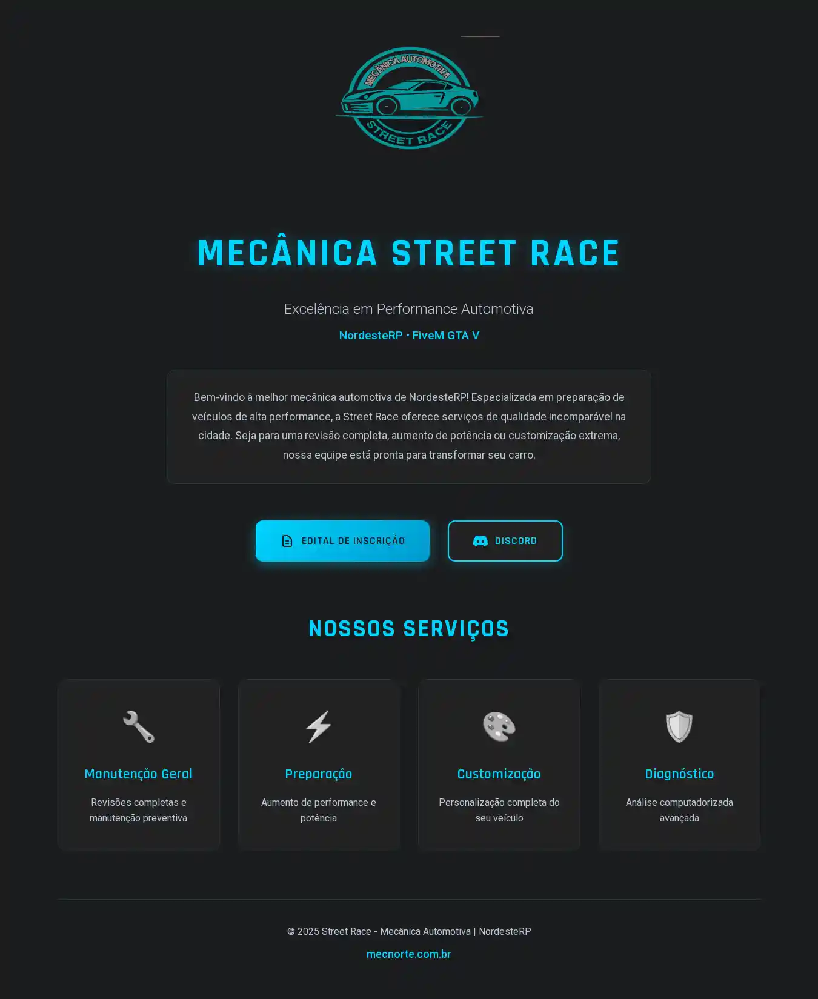
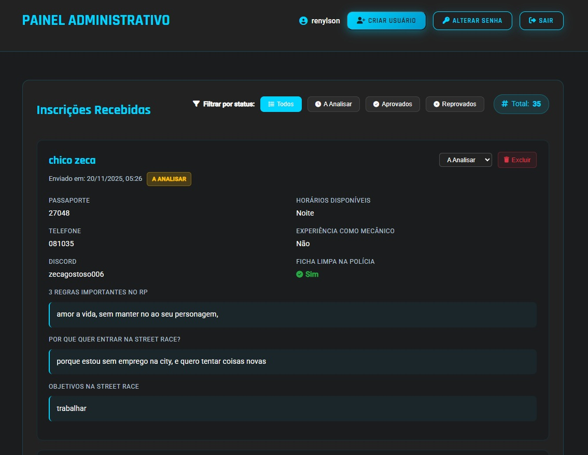

# Site + Sistema de Inscrição - Mecânica Street Race 🚗💨

> **Projeto desenvolvido para a cidade NordesteRP (GTA V Roleplay)**

Este sistema foi criado para atender a uma demanda real da **Mecânica Street Race** no servidor NordesteRP. O objetivo foi automatizar e profissionalizar o processo de recrutamento de novos mecânicos, substituindo métodos manuais por uma aplicação web robusta.

Além de resolver um problema prático, este projeto faz parte do meu portfólio de transição de carreira para a área de desenvolvimento, demonstrando competências em **Full Stack**, **Banco de Dados** e **DevOps**.

## 🎯 Objetivo do Projeto

Desenvolver uma solução completa contendo:
1.  **Landing Page**: Apresentação da mecânica.
2.  **Sistema de Recrutamento**: Formulário de inscrição para interessados em trabalhar na mecânica (RP).
3.  **Gestão Administrativa**: Painel restrito para que o dono e gerentes possam visualizar e selecionar candidatos.

## 🚀 Funcionalidades

- ✅ Página principal com informações da mecânica
- ✅ Formulário de inscrição completo
- ✅ Painel administrativo protegido por login
- ✅ Visualização de todas as inscrições
- ✅ Sistema de autenticação seguro
- ✅ Banco de dados SQLite
- ✅ Deploy com Docker

## 📋 Páginas

Caso deseja visualizar em produção: [clique aqui!](https://mecnorte.com.br/)

- **index.html** - Página principal

- **edital.html** - Formulário de inscrição

- **admin.html** - Painel administrativo


## 🔐 Credenciais Padrão

**⚠️ IMPORTANTE: Altere a senha após o primeiro login!**

- Usuário: `admin`
- Senha: `admin123`

## 🐳 Instalação com Docker

### Pré-requisitos
- Docker instalado
- Docker Compose instalado

### Passos

1. **Build e iniciar o container:**
```bash
docker-compose up -d
```

2. **Acessar a aplicação:**
- Site principal: http://seuip:3000/index.html
- Formulário: http://seuip:3000/edital.html
- Painel Admin: http://seuip:3000/admin.html

3. **Parar o container:**
```bash
docker-compose down
```

4. **Ver logs:**
```bash
docker-compose logs -f
```

## 💻 Instalação Manual (sem Docker)

### Pré-requisitos
- Node.js 18+ instalado

### Passos

1. **Instalar dependências:**
```bash
npm install
```

2. **Iniciar o servidor:**
```bash
npm start
```

3. **Para desenvolvimento (com auto-reload):**
```bash
npm run dev
```

## 📁 Estrutura do Projeto

```
mecanica/
├── index.html          # Página principal
├── edital.html         # Formulário de inscrição
├── admin.html          # Painel administrativo
├── styles.css          # Estilos principais
├── edital.css          # Estilos do formulário
├── admin.css           # Estilos do painel admin
├── admin.js            # JavaScript do painel admin
├── logo.svg            # Logo da mecânica
├── server.js           # Servidor Node.js/Express
├── package.json        # Dependências do projeto
├── Dockerfile          # Configuração Docker
├── docker-compose.yml  # Orquestração Docker
└── mecanica.db         # Banco de dados SQLite (criado automaticamente)
```

## 🔧 Configurações

### Alterar Porta

Edite o arquivo `docker-compose.yml`:
```yaml
ports:
  - "SUA_PORTA:3000"
```

Ou defina a variável de ambiente:
```bash
PORT=8080 npm start
```

### Alterar Credenciais Iniciais

Edite o arquivo `server.js` na linha que cria o usuário admin padrão.

## 📊 Banco de Dados

O sistema usa SQLite com duas tabelas:

- **inscricoes** - Armazena os dados dos formulários
- **usuarios** - Gerencia os usuários administrativos

## 🔒 Segurança

- ✅ Senhas criptografadas com bcrypt
- ✅ Sessões seguras
- ✅ Proteção de rotas administrativas
- ✅ Validação de formulários


## 🛠️ Tecnologias Utilizadas

- **Frontend:** HTML5, CSS3, JavaScript
- **Backend:** Node.js, Express
- **Banco de Dados:** SQLite (better-sqlite3)
- **Autenticação:** bcryptjs, express-session
- **Deploy:** Docker, Docker Compose


## 👨‍💻 Sobre o Autor

**Renylson Marques**

Profissional com background técnico em telecomunicações e experiência prática em infraestrutura, automação e desenvolvimento. Atualmente em transição para a área de desenvolvimento de software (Backend, Frontend ou DevOps).

- **Foco**: Python, Node.js, React, Docker, SQL e Automação.
- **Perfil**: Orientado a resultados, documentação, troubleshooting avançado e entrega orientada a SLAs.
- **Formação**: Cursando Engenharia de Software.

### Contato
- 📧 **Email**: renylsonm@gmail.com
- 📱 **Telefone**: (87) 98846-3681
- 💼 **LinkedIn**: [Renylson Marques](https://www.linkedin.com/in/renylsonmarques/)
- 🐙 **GitHub**: [Renylson](https://github.com/renylson)

---

Desenvolvido com 💙 por Renylson Marques para Street Race - Mecânica Automotiva | NordesteRP © 2025